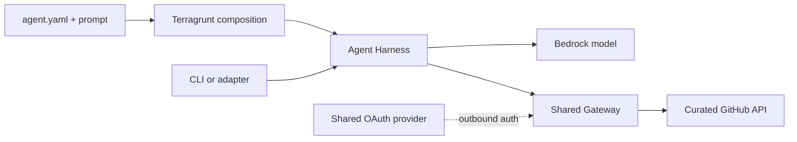

# Design and principles

## Objective

Make simple AgentCore agents declarative without hiding identity, security,
state, or lifecycle boundaries.



## Principles

1. **Intent stays declarative.** YAML describes model, prompt, limits, and
   eventually tools and identity requirements. It does not contain executable
   business logic, provider mechanics, ARNs, account IDs, or secrets.

2. **Each layer has one job.** Terragrunt resolves files, environment context,
   and dependencies. Terraform modules own AWS resources and IAM. Clients own
   rendering, sessions, and protocol-specific behavior.

3. **Ownership follows lifecycle.** OAuth providers and Gateways are shared
   platform components. Harnesses, prompts, execution roles, and tool allow-lists
   belong to agents. Deleting an agent must not delete shared platform resources.

4. **Dependencies point toward consumers.**

   ```text
   platform/github-oauth -> platform/github-gateway -> agents/*
   ```

   Platform stacks never depend on agent state. Consumers use typed, non-secret
   outputs; copied ARNs and manual reverse handoffs are avoided.

5. **State mirrors ownership.** Each independently managed component has its own
   encrypted, locked state. Ownership changes use reviewed, versioned state
   operations with zero resource recreation when practical.

6. **Secrets cross the narrowest boundary.** Secret values stay out of YAML,
   HCL, plans, outputs, logs, and normal state. SSM references feed ephemeral
   Terraform variables and provider write-only arguments. ARNs are not secrets.

7. **Expose the minimum interface.** The GitHub spike allows exactly
   `GET /user`, operation `getAuthenticatedUser`, OAuth scope `read:user`,
   and Harness tool `@github/getAuthenticatedUser`. No `repo`, mutations,
   arbitrary URLs, or caller-supplied headers.

8. **Identity is proven, not inferred.** A caller-supplied `runtimeUserId` is
   opaque. IAM/SigV4 invocation does not prove end-user identity or Token Vault
   isolation. User-authorized OAuth requires JWT-backed inbound identity and a
   two-user isolation test.

9. **Shared configuration is not shared identity.** Multiple agents may reuse an
   OAuth provider and Gateway. This does not imply that end-user tokens are
   shared or isolated across agents; live identity tests decide that claim.

10. **Verification is layered.** Formatting and unit tests prove source
    contracts. A plan proves proposed infrastructure. Apply/readiness proves
    resources. Invocation proves runtime behavior. Documentation must name the
    highest completed layer.

11. **Provider workarounds stay contained.** Provider-specific shapes and
    temporary control-plane workarounds belong in modules or composition, never
    in the public YAML contract.

12. **Mutation requires a separate safety design.** GitHub write operations need
    explicit confirmation, least privilege, and auditability before entering the
    contract.

## Ownership

### Agent contract

`agents/<name>/agent.yaml` owns engine, model, prompt reference, limits, tags,
and future normalized capabilities. Prompts remain adjacent reviewable files.
References must not escape the agent directory.

### Platform composition

`live/<environment>/<region>/platform/` owns shared account/region services.
Current units:

- `github-oauth` — native AgentCore `GithubOauth2` provider.
- `github-gateway` — MCP/IAM Gateway, scoped role, and curated OpenAPI target.

### Agent composition

`live/<environment>/<region>/agents/<name>/` composes one agent with reviewed
platform outputs. Each Harness keeps an independent lifecycle and execution role.

### Terraform modules

Modules accept resolved typed values. They own AWS mechanics, IAM, tags,
validation, lifecycle, and non-secret outputs. They do not decode agent YAML or
read repository files.

### Clients

The CLI and Telegram adapter are thin callers. They keep stable user identifiers
and replaceable session identifiers, render safe output, and never own
infrastructure or prompts.

## Runtime and identity

Harness is the default declarative engine. Runtime is introduced only for a
demonstrated orchestration, middleware, or library requirement.

The current public-read GitHub proof uses a GitHub OAuth App because AgentCore
supports it natively. It cannot satisfy read-only private-repository access:
GitHub OAuth App `repo` is too broad. Private source access requires a GitHub
App or custom provider preserving app permissions, installation scope, and user
authorization.

The configured post-consent destination is
`https://t.me/gh_agent_517_bot?start=github-consent`. AgentCore's generated
callback URL remains the value registered in the GitHub OAuth App; these URLs
serve different purposes.

## Contract and versioning

The public agent contract is `agentcore.example/v1alpha1`. Additive experiments
may remain in `v1alpha1`; breaking semantics require a new version and migration
notes. Executable GitHub contracts live under `contracts/github/` and are
validated independently from prose.
