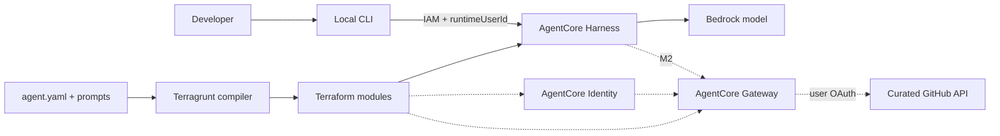

# System design

## Objective

Provide a human-friendly, versioned YAML contract for deploying and operating
Amazon Bedrock AgentCore agents through Terragrunt and Terraform. The abstraction
must make simple agents simple without hiding identity, security, or lifecycle
boundaries.

## Architecture

Solid lines are the M0 scope. Dotted lines are planned GitHub integration work.

## Layers and ownership

### Agent specification

`agents/<name>/agent.yaml` owns product intent:

- engine selection;
- model and inference parameters;
- prompt references;
- limits;
- eventually tools, identity requirements, memory, and safety policy.

The YAML must not contain provider-specific ARN construction, Terraform lifecycle
details, secrets, arbitrary code, or environment/account identifiers.

### Prompt and skill assets

Prompts live beside the agent and are referenced by relative path. This keeps large
instructions reviewable and testable. A prompt reference must remain within its
agent directory. Future skills should use the same ownership model or immutable
Git/S3 references.

### Terragrunt composition

`live/<environment>/<region>/<agent>/terragrunt.hcl`:

- loads and decodes YAML;
- resolves local files;
- supplies environment context;
- translates camelCase contract fields to Terraform inputs;
- composes modules and dependencies.

Terragrunt is a thin compiler/composition boundary, not the location for agent
behavior.

### Terraform modules

Modules own AWS resource mechanics, IAM, tags, lifecycle, and outputs. Inputs are
resolved typed values, not filesystem paths or raw YAML strings. Modules should be
small and composable:

- `agentcore-harness` — current;
- `agentcore-gateway` — planned;
- `agentcore-oauth-provider` — planned;
- `agentcore-memory` — planned;
- state/observability modules — planned.

### Clients and adapters

Clients own presentation and protocol behavior. The local CLI signs requests with
the developer's AWS credentials, provides stable user/session identifiers, and
renders streamed Harness events. It does not own agent prompts or infrastructure.

## Runtime choice

Harness is the default because the desired abstraction is declarative: model,
prompt, tools, memory, and limits. Custom AgentCore Runtime is introduced only
after a concrete requirement needs custom orchestration, middleware, or libraries.
Both engines may eventually implement the same normalized agent contract where
their capabilities overlap.

## Identity model

### Inbound

M0 uses IAM/SigV4 from a trusted CLI. The CLI derives a non-sensitive stable local
user ID and sends a separate random session ID. Shared or browser interfaces should
use an actual JWT identity provider rather than accepting arbitrary user IDs.

### Outbound GitHub

The target design uses a GitHub App user access token managed by AgentCore
Identity. Effective access is limited by the app permissions, installation scope,
and the user's own GitHub permissions. AgentCore Gateway exposes a curated OpenAPI
surface rather than the whole GitHub API.

The first GitHub deployment is read-only. Mutations require a separate design for
confirmation, authorization, and auditability.

## Secrets

- YAML contains logical credential references only.
- OAuth client credentials enter Terraform through ephemeral variables and provider
  write-only arguments where supported.
- Secret values are never outputs.
- Plans and state are inspected before accepting an OAuth implementation.
- Local `.env` files and state are ignored and must not be committed.

## Versioning

The current contract is `agentcore.example/v1alpha1`. Additive experimental fields
may be introduced within `v1alpha1`; breaking semantic changes require a new
version and migration documentation. Terraform provider schemas are not exposed as
the public YAML contract.

## Deployment environments

M0 uses local state for a single developer lab. Shared environments require an
explicit state bootstrap with encryption, locking, and recovery documentation.
Environment overlays must not silently override security-sensitive agent intent.

## Known design risks

- AgentCore Harness and its Terraform resource are new and may have provider/API
  defects; keep deployment evidence separate from static validation.
- End-to-end Harness → Gateway → Identity user binding must be proven before the
  GitHub schema is stabilized.
- The current Bedrock IAM policy uses `Resource = "*"`; this is tracked for
  hardening.
- A deny-by-default Harness tool allow-list currently uses an unmatched sentinel;
  validate that behavior against the live API during TF-001/AWS-001.

