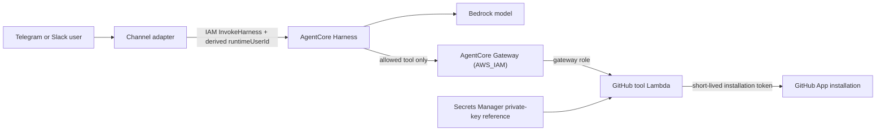
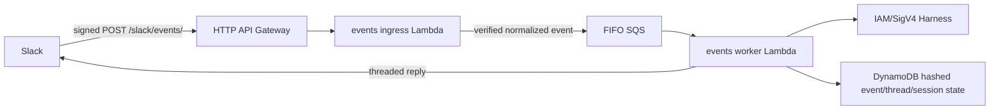

# Design and principles

## Decision

Keep AgentCore Harness as the managed agent loop. Put channel handling at a
trusted edge. Give the agent a GitHub App installation identity through an
AgentCore Gateway Lambda target.

The first complete product slice is:

```text
Telegram long polling or Slack HTTPS Events
  -> trusted channel adapter
  -> IAM/SigV4 InvokeHarness
  -> AgentCore Harness
  -> IAM-authorized AgentCore Gateway
  -> Lambda GitHub tool broker
  -> selected-repository GitHub App installation
```

This is an agent-owned GitHub identity. It is not user-delegated access.
User-delegated GitHub remains a later option, gated on a working Harness 3LO
implementation or an explicit decision to replace Harness with custom Runtime.

## Why this design

The native Harness `agentcore_gateway` authorization-code flow was tested on
2026-07-24. The Harness MCP client called `GetResourceOauth2Token` without
`ResourceOauth2ReturnUrl`, despite the same return URL being configured on the
Harness tool and generated workload identity. It never produced a usable
consent flow.

That failure is specific to user-delegated outbound OAuth. It does not invalidate
Harness, Gateway, IAM invocation, or machine-owned tools.

A GitHub App installation is the smallest secure path to useful repository
access:

- installation tokens represent the app, not a human;
- installation is limited to selected repositories;
- permissions are explicit and narrower than OAuth App `repo`;
- short-lived installation tokens are created inside the tool broker and never
  enter prompts, Harness events, or channel messages;
- no Cognito account, browser link, refresh-token store, or per-user Token Vault
  binding is required.

## Architecture


```mermaid
flowchart LR
  U["Telegram or Slack user"] --> A["Channel adapter"]
  A -->|"IAM InvokeHarness + derived runtimeUserId"| H["AgentCore Harness"]
  H --> M["Bedrock model"]
  H -->|"allowed tool only"| G["AgentCore Gateway (AWS_IAM)"]
  G -->|"gateway role"| L["GitHub tool Lambda"]
  L -->|"short-lived installation token"| GH["GitHub App installation"]
  S["Secrets Manager private-key reference"] --> L
```

### Trust boundaries

| Boundary | Authentication | Authorization |
|---|---|---|
| Telegram to adapter | Telegram Bot API over the bot-authenticated `getUpdates` channel | private chats and configured Telegram user allow-list |
| Slack to adapter | HMAC-signed HTTPS Events request | per-agent route, signing secret, workspace ID, and App ID; DMs and threads opened by mentioning an invited bot |
| Adapter to Harness | one narrowly scoped AWS IAM role using SigV4 | `bedrock-agentcore:InvokeAgentRuntime` on one exact Harness ARN; the SDK operation is `InvokeHarness` |
| Harness to Gateway | Harness execution role | `InvokeGateway` on one Gateway and exact `allowedTools` |
| Gateway to Lambda | Gateway service role | `lambda:InvokeFunction` on one qualified function ARN |
| Lambda to GitHub | GitHub App JWT exchanged for an installation token | selected installation, repository allow-list, and exact App permissions |
| Browser to `slack-oauth-callback` | none (public HTTPS `GET`); the request itself carries a signed, expiring, per-agent `state` | state signature verified against the claimed agent's `state_signing_key`; workspace, App ID, and `redirect_uri` pinned to the values the state was signed for; the exchanged `code` is single-use at Slack |
| `slack-oauth-callback` to Slack | Slack App `client_id`/`client_secret` (per agent, read from SSM) | fixed `https://slack.com/api/oauth.v2.access` endpoint only; response `ok`, workspace, App ID, and bot token are all re-checked before any write |
| `slack-oauth-callback` to SSM | Lambda execution role | `ssm:GetParameter`/`ssm:PutParameter` on only `/agent-core/slack/agents/*/{binding,credentials}`; `kms:Decrypt`/`kms:Encrypt`/`kms:GenerateDataKey` on `alias/aws/ssm` |

The adapter derives `runtimeUserId`; users never supply it. It is a session and
memory partition key, not proof that GitHub acted as that user. Use a
pseudonymous stable value:

```text
sha256(channel + ":" + workspace_or_bot + ":" + platform_user_id)
```

Do not mix Telegram and Slack history unless a separate, explicit account-linking
feature is designed.

## Components

### Agent contract

`agents/<name>/agent.yaml` owns portable intent: model, prompt, limits, tags,
normalized capability names, and requested interfaces. A Slack interface is
declared with display intent only:

```yaml
spec:
  interfaces:
    slack:
      name: GitHub Assistant
```

The platform compiles this into the reviewed Slack app manifest. The environment
binding owns the Slack workspace and App IDs, app and bot token references,
Harness ARN, IAM role, and adapter deployment. The agent YAML does not contain
provider ARNs, account IDs, installation IDs, channel tokens, private keys,
callback URLs, or IAM.

The compiler boundary must emit a normalized object before Terraform modules
consume it. Raw YAML field naming must not leak into modules.

### Channel core

Create a shared channel-neutral application service. Adapters translate native
events into:

```text
ChannelMessage {
  channel
  tenant_id
  user_id
  conversation_id
  message_id
  text
}
```

The shared service owns:

- allow-list enforcement;
- stable user/session derivation;
- `/new`, help, and retry behavior;
- duplicate-event suppression;
- Harness invocation and safe stream rendering;
- output chunking and redacted diagnostics.

Adapters own only transport parsing, acknowledgement, and response delivery.

Telegram remains private-chat long polling for development. Slack uses signed
HTTPS Events. Each Slack App represents one agent and receives an app-specific
request URL on the shared API Gateway: `POST /slack/events/<metadata.name>`.
The path selects the signing secret before the body is trusted; HMAC validation,
the five-minute timestamp window, workspace ID, and App ID must all pass before
the event is queued.


```mermaid
flowchart LR
  S["Slack"] -->|"signed POST /slack/events/<agent>"| G["HTTP API Gateway"]
  G --> I["events ingress Lambda"]
  I -->|"verified normalized event"| Q["FIFO SQS"]
  Q --> W["events worker Lambda"]
  W --> H["IAM/SigV4 Harness"]
  W -->|"threaded reply"| S
  W --> D["DynamoDB hashed event/thread/session state"]
```

Ingress returns the signed `url_verification` challenge synchronously. Normal
events are acknowledged only after FIFO enqueue, keeping the public request
under Slack's three-second limit. Queue groups are hashed App/channel/root
identifiers; `event_id` is the dedupe key. The worker stores no message text,
Slack IDs, or user IDs in DynamoDB: only hashed event, registered-thread, and
active-session keys with event TTLs. Durable session overrides preserve `/new`
across Lambda invocations. DMs start sessions directly; channel replies are
accepted only for roots opened by `app_mention`.

The OAuth callback remains a separate Lambda and IAM role on
`GET /slack/oauth/callback`. Its compact signed state binds agent, workspace,
App, redirect URI, and expiry before code exchange or SSM writes. OAuth and
Events share the API Gateway and per-agent SSM schema, not execution roles.

| Parameter | Type | Contents |
|---|---|---|
| `/agent-core/slack/provisioner/config` | `SecureString` | Manifest configuration token and refresh token. |
| `/agent-core/slack/agents/<name>/binding` | `String` | Agent, workspace, App, manifest digest, install state, bot user ID, granted scopes. |
| `/agent-core/slack/agents/<name>/credentials` | `SecureString` | Client secret, signing secret, state-signing key, bot token. No Socket Mode app token. |

`metadata.name` is the immutable route, SSM path, and reconciliation identity;
`spec.interfaces.slack.name` is display intent only. The reconciler renders both
the OAuth redirect URI and Events request URL. A successful migration update
removes the legacy app token from the credentials value. A merge authorizes only
Slack manifest create/update and exact SSM writes; installation approval,
Terraform apply, image push, and live invocation remain separate gates.

Deploy in this order: publish the immutable ARM64 Events image; compose and
apply ingress, queue, worker, state table, and routes; read the per-agent
`events_url` output; then reconcile the Slack manifest with matching
`--redirect-uri` and `--events-url`. This order keeps signed URL verification
available before Socket Mode is removed from the external Slack App.

### Harness

Harness remains the only agent loop. Deploy one IAM/SigV4 Harness without native
authorization-code OAuth. Its custom ARM64 container supplies Git, GitHub CLI,
and the project toolchain; built-in shell and file operations are explicitly
allowed for repository work.

Mount AgentCore-managed session storage at `/mnt/workspace`. A coding session
clones and edits source, runs tests, and uses Git/GitHub CLI from that same
workspace. Storage persists across stop/resume only for the same
`runtimeSessionId`; it is neither a cross-user identity mechanism nor shared
durable storage. This avoids an always-on VPC, NAT gateway, and EFS bill in the
home-lab deployment. Add EFS later only when cross-session/shared persistence
is an actual requirement.

### Temporary direct GitHub credentials

This home-lab deployment temporarily accepts direct credential exposure to make
native `git` and `gh` usable. The existing broker Lambda remains the only
component with `secretsmanager:GetSecretValue` for the App private key. The
Harness execution role can invoke only that Lambda. A helper in the custom
image defaults its non-secret region and broker name to `us-east-1` and
`github-app-tool`, while allowing environment overrides. It requests a fresh,
one-repository installation token; the token is passed
only to the immediate `git`/`gh` process and never becomes a Terraform value,
Harness environment variable, or persisted credential file.

This does not isolate credentials from the LLM. Harness command execution runs
as root, its execution-role credentials are available inside the microVM, and a
root-capable agent can call the helper or inspect a token-bearing process. A
GitHub App installation token lasts one hour and can act within its selected
repository and permission scope. Do not place the private key in the Harness,
and do not print, log, prompt, commit, or otherwise persist the temporary
token.

This is a deliberate, temporary risk acceptance. Before production use,
replace it with a credential-isolated MCP/service boundary: the remote worker
must retain the token and offer structured Git operations rather than a
token-returning interface.

The execution role gets only model invocation, required Harness-managed
session/memory access, observability, and `InvokeGateway` on the selected
Gateway. Remove Token Vault, OAuth client-secret, and
`GetResourceOauth2Token` permissions from the machine-identity deployment.

### GitHub Gateway and tool broker (transition state)

The deployed `AWS_IAM` Gateway/Lambda slice is transitional. It proves the App
identity and selected-repository boundary, but its REST operations do not give
the agent a real checkout. HARNESS-003 replaces it with native workspace tools;
retire the Gateway slice after live native proof.

Tools:

| Tool | Inputs | Enforced boundary |
|---|---|---|
| `listRepositories` | optional page | reads the current selected repositories from the GitHub App installation; 100 results per bounded page |
| `getRepository` | owner, repo | GitHub validates the repository against the current installation; token is narrowed to that repository |
| `getFile` | owner, repo, path, optional ref | current-installation repository only; size and binary limits |
| `createBranch` | owner, repo, branch, source commit SHA | current-installation repository only; fixed Git ref endpoint |
| `putFile` | owner, repo, path, UTF-8 content, commit message, branch, optional blob SHA | current-installation repository only; fixed contents endpoint |
| `createPullRequest` | owner, repo, title, head, base, optional body | current-installation repository only; fixed pull-request endpoint |
| `mergePullRequest` | owner, repo, number, optional merge method | current-installation repository only; fixed merge endpoint |
| `createIssue` | owner, repo, title, optional body | current-installation repository only; fixed issue endpoint |

The agent autonomously runs a supported operation when the user asks. No
confirmation turn is inserted. No arbitrary URL, GraphQL document, HTTP method,
header, shell command, or repository wildcard is exposed.

The Lambda:

1. validates the Gateway tool name and JSON input;
2. uses an installation token to list the App's current selected repositories, or requests a per-repository narrowed token for a read;
3. reads the GitHub App private key from a referenced secret;
4. creates a short-lived App JWT;
5. requests an installation token narrowed to the required repository and
   permissions;
6. calls a fixed GitHub REST endpoint with an explicit API version and
   `User-Agent`;
7. returns a bounded, normalized response;
8. logs only request IDs, tool name, installation/repository IDs, status,
   duration, and error class.

Never log or return App JWTs, installation tokens, private-key material,
authorization headers, or raw provider errors. Return only the requested bounded
repository content to Harness; never copy that content into diagnostics.

### Container images

Every deployable artifact is a container image. The broker Lambda uses
`package_type = "Image"`; there is no zip packaging path.

`docker-bake.hcl` owns the buildable set. Each target declares its Dockerfile,
context, image repository, and `linux/arm64` platform once.

Images are built only from a clean committed revision and tagged with its full
Git commit ID. The ECR repositories have immutable tags; Buildx returns the
published digest through its metadata file.

Terraform consumes `@sha256:` digests, never tags. The `image_uri` variable
rejects anything that is not a full 64-hex digest, so a mutable reference
cannot reach a deployed function. Digests are pinned as reviewable literals in
Terragrunt rather than read from a Terraform output, because an ECR output
exposes only the mutable repository URL — a dependency edge would imply an
automatic wiring that does not exist.

Ownership of ECR repositories follows the resource that pins them.
`modules/container-registry` owns repositories for new images.
`github-app-tool-coding` remains in `modules/github-app-tool` while deployed
Harness v20 pins a digest inside it; moving it is a separate, plan-reviewed
migration.

### GitHub App

MVP permissions:

- Repository metadata: read-only/implicit.
- Contents: read and write.
- Pull requests: read and write.
- Issues: read and write.
- Selected repositories only.
- No webhooks unless a later feature needs them.
- No organization permissions.

The App ID and installation ID are non-secret configuration. The private key is
a secret. Terraform consumes only its secret ARN; secret material must not
enter Terraform state.

#### Operator contract

The App registration and each installation must meet all of these conditions:

| Item | Required value or action |
|---|---|
| Repository permissions | `Contents`, `Pull requests`, and `Issues`: read and write. Repository metadata is the GitHub implicit read capability; request no organization or account permission. |
| Organization and account permissions | None. |
| Webhooks | Inactive; subscribe to no events. |
| Installation scope | `Only select repositories`. This live GitHub installation selection is the repository boundary; do not duplicate it in Lambda configuration or select all repositories. |
| App identity | Record the numeric App ID as `GITHUB_APP_ID`; do not substitute the client ID. |
| Installation identity | Record the numeric selected-repository installation ID as `GITHUB_APP_INSTALLATION_ID`. Verify it belongs to the expected owner and contains only the selected repositories. |
| Private key | Generate an App private key outside Terraform. Store its material in a pre-existing Secrets Manager secret. Provide only that secret ARN as `GITHUB_APP_PRIVATE_KEY_SECRET_ARN`; never place key material in variables, plans, state, logs, or source. |

The broker will mint a fresh installation token per request. Repository reads
are narrowed to the requested repository and `contents: read`; repository
listing uses the installation's current selected-repository scope. Installation tokens expire
after one hour; do not validate their shape or length.

Rotation is an operator change: add the replacement private key to the
pre-existing secret, validate a staged deployment can read with the new key,
then revoke the old GitHub App key. Preserve the secret ARN. If validation
fails, restore the previous secret version before revoking anything. Do not
disable the installation or broaden permissions as a rotation workaround.

Rollback means stop the GitHub slice, remove the Lambda's permission to read
the private-key secret or roll back to the prior validated Lambda version, and
revoke the affected App key if compromise is suspected. Do not delete the App,
installation, secret, or Terraform state as an incident shortcut. Re-enable
only after the selected-repository scope, exact permissions, and secret
access boundary are re-verified.

## User-delegated GitHub

GitHub App user access tokens are the preferred eventual user identity because
their effective access is the intersection of App permissions, installation
scope, and user permissions.

Do not implement user delegation by passing a model-supplied user ID to the
Lambda target. AgentCore Lambda target context does not document an authenticated
end-user identity field, so that would permit confused-deputy behavior.

User delegation may proceed only when one of these is true:

1. Harness fixes and live validation proves its 3LO call includes the return
   URL and preserves two-user token isolation; or
2. the project explicitly accepts a custom Runtime or trusted orchestration
   service that performs OAuth and tool calls with authenticated user context.

Required proof: authorize A only; B receives no A data; authorize B; both users
receive only their own GitHub results; token reuse and revocation are tested.

## State and lifecycle

Target state owners:

```text
platform/github-app-tool       -> Gateway, Lambda target, Lambda, roles, logs
platform/slack-oauth-callback  -> Lambda, HTTP API Gateway, IAM role, logs
agents/github-assistant        -> Harness, execution role, model/tool configuration
```

GitHub App registration, installation, repository selection, and private-key
creation are operator actions. Terraform receives non-secret IDs and a
pre-existing secret ARN.

The source for the deployed Cognito identity stack, JWT Gateway/Harness, and
OAuth provider was removed. Do not recreate it. Retirement still requires
separate reviewed destroy plans and explicit authorization; retained S3 state
history is not a runtime dependency.

## Safety

- Repository boundary enforced by GitHub App installation scope, not only in the prompt.
- Exact Harness `allowedTools`.
- Bounded inputs and outputs.
- Deny raw URLs, arbitrary refs where policy requires a fixed branch, and path
  traversal-like values.
- Channel allow-lists before Harness invocation.
- Per-channel rate limits and concurrency limits.
- No platform credentials in YAML, state, plans, logs, events, prompts, or
  replies. Treat retrieved private repository content as sensitive user data.
- Every mutation has a separate fixed tool; supported user requests execute
  without a confirmation turn. Tool and request metadata provide audit evidence.

## Verification model

Claims remain layered:

1. source formatting and unit tests;
2. provider-backed Terraform/Terragrunt validation;
3. reviewed plans;
4. applied resources and readiness;
5. successful Harness chat from each channel;
6. successful GitHub tool call through the full path;
7. security-negative tests.

Never collapse these into “working.”

## Validation basis

Reviewed 2026-07-24 against:

- AWS Harness tools: <https://docs.aws.amazon.com/bedrock-agentcore/latest/devguide/harness-tools.html>
- AWS Gateway Lambda targets: <https://docs.aws.amazon.com/bedrock-agentcore/latest/devguide/gateway-add-target-lambda.html>
- AWS Gateway target authorization: <https://docs.aws.amazon.com/bedrock-agentcore/latest/devguide/gateway-building-adding-targets-authorization.html>
- AWS inbound/outbound identity: <https://docs.aws.amazon.com/bedrock-agentcore/latest/devguide/runtime-oauth.html>
- GitHub App authentication: <https://docs.github.com/en/apps/creating-github-apps/authenticating-with-a-github-app/about-authentication-with-a-github-app>
- GitHub App permission selection: <https://docs.github.com/en/apps/creating-github-apps/registering-a-github-app/choosing-permissions-for-a-github-app>
- Slack Events API: <https://docs.slack.dev/apis/events-api/>
- Slack request verification: <https://docs.slack.dev/authentication/verifying-requests-from-slack/>
- Telegram Bot API: <https://core.telegram.org/bots/api>

Provider 6.55.0 source validation already demonstrated Harness and Gateway
resources. The Lambda-target schema still requires a local provider-backed
validation task before implementation is called ready.

## Principles

1. Harness is the product constraint; custom Runtime is an explicit exception.
2. Machine identity before user delegation.
3. Channel identity partitions sessions; it does not silently become GitHub
   identity.
4. Policy is enforced at the narrowest executable boundary.
5. Ownership and state follow independent lifecycles.
6. YAML owns portable intent; environment composition owns bindings.
7. Secrets cross by reference only.
8. New capabilities are deny-by-default and evidence-driven.
9. Mutation is a different product, not an extra scope.
10. Documentation states the highest verified layer only.
11. Direct Harness GitHub tokens are a temporary home-lab risk acceptance.
    Keep the App private key Lambda-only and replace token delivery with a
    bounded server-side broker before production use.
12. Deployable artifacts are ARM64 container images built from a clean commit,
    and deployments pin image digests, never tags.
