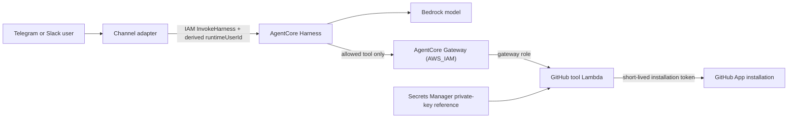
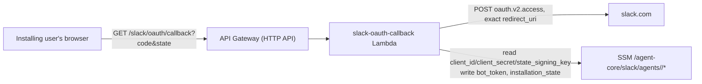

# Design and principles

## Decision

Keep AgentCore Harness as the managed agent loop. Put channel handling at a
trusted edge. Give the agent a GitHub App installation identity through an
AgentCore Gateway Lambda target.

The first complete product slice is:

```text
Telegram long polling or Slack Socket Mode
  -> trusted channel adapter
  -> IAM/SigV4 InvokeHarness
  -> AgentCore Harness
  -> IAM-authorized AgentCore Gateway
  -> Lambda GitHub tool broker
  -> selected-repository GitHub App installation
```

This is an agent-owned GitHub identity. It is not user-delegated access.
User-delegated GitHub remains a later option, gated on a working Harness 3LO
implementation or an explicit decision to replace Harness with custom Runtime.

## Why this design

The native Harness `agentcore_gateway` authorization-code flow was tested on
2026-07-24. The Harness MCP client called `GetResourceOauth2Token` without
`ResourceOauth2ReturnUrl`, despite the same return URL being configured on the
Harness tool and generated workload identity. It never produced a usable
consent flow.

That failure is specific to user-delegated outbound OAuth. It does not invalidate
Harness, Gateway, IAM invocation, or machine-owned tools.

A GitHub App installation is the smallest secure path to useful repository
access:

- installation tokens represent the app, not a human;
- installation is limited to selected repositories;
- permissions are explicit and narrower than OAuth App `repo`;
- short-lived installation tokens are created inside the tool broker and never
  enter prompts, Harness events, or channel messages;
- no Cognito account, browser link, refresh-token store, or per-user Token Vault
  binding is required.

## Architecture


```mermaid
flowchart LR
  U["Telegram or Slack user"] --> A["Channel adapter"]
  A -->|"IAM InvokeHarness + derived runtimeUserId"| H["AgentCore Harness"]
  H --> M["Bedrock model"]
  H -->|"allowed tool only"| G["AgentCore Gateway (AWS_IAM)"]
  G -->|"gateway role"| L["GitHub tool Lambda"]
  L -->|"short-lived installation token"| GH["GitHub App installation"]
  S["Secrets Manager private-key reference"] --> L
```

### Trust boundaries

| Boundary | Authentication | Authorization |
|---|---|---|
| Telegram to adapter | Telegram Bot API over the bot-authenticated `getUpdates` channel | private chats and configured Telegram user allow-list |
| Slack to adapter | pre-authenticated Socket Mode WebSocket | one configured workspace; every workspace user; DMs and threads opened by mentioning an invited bot |
| Adapter to Harness | one narrowly scoped AWS IAM role using SigV4 | `InvokeHarness` on one Harness; `InvokeHarnessForUser` only if required by the final SDK/API shape |
| Harness to Gateway | Harness execution role | `InvokeGateway` on one Gateway and exact `allowedTools` |
| Gateway to Lambda | Gateway service role | `lambda:InvokeFunction` on one qualified function ARN |
| Lambda to GitHub | GitHub App JWT exchanged for an installation token | selected installation, repository allow-list, and exact App permissions |
| Browser to `slack-oauth-callback` | none (public HTTPS `GET`); the request itself carries a signed, expiring, per-agent `state` | state signature verified against the claimed agent's `state_signing_key`; workspace, App ID, and `redirect_uri` pinned to the values the state was signed for; the exchanged `code` is single-use at Slack |
| `slack-oauth-callback` to Slack | Slack App `client_id`/`client_secret` (per agent, read from SSM) | fixed `https://slack.com/api/oauth.v2.access` endpoint only; response `ok`, workspace, App ID, and bot token are all re-checked before any write |
| `slack-oauth-callback` to SSM | Lambda execution role | `ssm:GetParameter`/`ssm:PutParameter` on only `/agent-core/slack/agents/*/{binding,credentials}`; `kms:Decrypt`/`kms:Encrypt`/`kms:GenerateDataKey` on `alias/aws/ssm` |

The adapter derives `runtimeUserId`; users never supply it. It is a session and
memory partition key, not proof that GitHub acted as that user. Use a
pseudonymous stable value:

```text
sha256(channel + ":" + workspace_or_bot + ":" + platform_user_id)
```

Do not mix Telegram and Slack history unless a separate, explicit account-linking
feature is designed.

## Components

### Agent contract

`agents/<name>/agent.yaml` owns portable intent: model, prompt, limits, tags,
normalized capability names, and requested interfaces. A Slack interface is
declared with display intent only:

```yaml
spec:
  interfaces:
    slack:
      name: GitHub Assistant
```

The platform compiles this into the reviewed Slack app manifest. The environment
binding owns the Slack workspace and App IDs, app and bot token references,
Harness ARN, IAM role, and adapter deployment. The agent YAML does not contain
provider ARNs, account IDs, installation IDs, channel tokens, private keys,
callback URLs, or IAM.

The compiler boundary must emit a normalized object before Terraform modules
consume it. Raw YAML field naming must not leak into modules.

### Channel core

Create a shared channel-neutral application service. Adapters translate native
events into:

```text
ChannelMessage {
  channel
  tenant_id
  user_id
  conversation_id
  message_id
  text
}
```

The shared service owns:

- allow-list enforcement;
- stable user/session derivation;
- `/new`, help, and retry behavior;
- duplicate-event suppression;
- Harness invocation and safe stream rendering;
- output chunking and redacted diagnostics.

Adapters own only transport parsing, acknowledgement, and response delivery.

Telegram remains private-chat long polling for development. Slack starts with
Socket Mode because it needs no public request URL. Every Slack app represents
exactly one agent. Every workspace user may open a session with a top-level DM
or by mentioning an invited bot. The adapter replies in a thread, and the Slack
channel plus root timestamp identify one Harness session. Channel follow-ups do
not require another mention, so Slack must deliver `message.channels` and
`message.groups`; the adapter ignores every message outside a root previously
opened by `app_mention`. It persists only hashes of registered channel/thread
IDs partitioned by workspace and Slack App ID, never message content or user
IDs. Users invite bots to public or private channels; the platform requests no
channel-management permission.

### Slack provisioning and GitOps

`SLACK-002` covers reconciliation and the local macOS operator contract only.
`SLACK-003` remains deferred: no shared HTTPS Events ingress is part of this
slice. The existing macOS host uses one manually invoked launcher per selected
agent; the launcher replaces itself with that Socket Mode process.
Reconciliation never starts, stops, or restarts adapter processes.

App creation and update use Slack App Manifest APIs. A one-time bootstrap owns
one workspace configuration token and its refresh token in SSM Parameter Store;
the access token expires after 12 hours and must be rotated with
`tooling.tokens.rotate`. The token belongs to one Slack user in one workspace,
not one app, and can manage all apps that user owns in that workspace.

Use Standard-tier parameters and keep every JSON value below 4 KB:

| Parameter | Type | Contents |
|---|---|---|
| `/agent-core/slack/provisioner/config` | `SecureString` | Configuration access token and refresh token only. Updated together after every rotation. |
| `/agent-core/slack/agents/<metadata.name>/binding` | `String` | Workspace ID, Slack App ID, manifest digest, installation state, and last successful reconcile time. The callback Lambda additionally records `bot_user_id` and `granted_scopes` here after a successful install; both are nonsecret audit fields. No secret values. |
| `/agent-core/slack/agents/<metadata.name>/credentials` | `SecureString` | Client secret, signing secret, `state_signing_key` (generated locally at app creation; authenticates install-link state, never returned by Slack), bot token, and local-phase app token. Missing values remain absent, never empty placeholders. |

Use the default `alias/aws/ssm` key for the cost-lean home-lab phase. IAM is the
decryption boundary: the reconciler may read/write the provisioner path and all
Slack agent paths; each adapter launcher may decrypt only its one credentials
parameter and read its one binding. Do not load the provisioner parameter into
the repository-wide mise environment. Fetch it only inside the reconciler and
keep decrypted values in process memory.

`metadata.name` is immutable once its binding exists. It is the SSM path and
reconciliation identity. `spec.interfaces.slack.name` is mutable display intent
and updates the recorded app manifest; it never selects an app. A merge to
`main` is standing authorization only for Slack manifest create/update and the
exact SSM writes above. It does not authorize a Slack installation approval,
creation of an app-level token, controller/adapter process actions, Terraform
apply, or a live Harness invocation.

For a new agent spec merged to `main`, the reconciler:

1. validates the YAML and renders the exact Slack manifest, including the
   platform callback URL as the sole `oauth_config.redirect_urls` entry;
2. creates the app with `apps.manifest.create`, or updates its recorded App ID;
3. stores the returned client secret and signing secret, plus a freshly
   generated `state_signing_key`, in the agent's SSM `SecureString` parameter;
4. builds and emits a Slack `oauth/v2/authorize` install URL carrying the
   platform `redirect_uri` and a signed, expiring `state` (see below) as an
   approval action; `clients/slack/reconcile.py install-url` can mint a fresh
   one later without any Slack or SSM write, if the first link expires before
   a human clicks it;
5. waits for a human workspace installation approval; Slack then redirects
   the browser to the public callback, which exchanges the code and stores
   the app-specific bot token itself (below) — reconciliation performs no
   further action for this step;
6. waits for one human-created, app-specific `connections:write` token and
   writes it to the same `SecureString`.

### Public Slack OAuth installation callback

Socket Mode remains the only channel for runtime events; it needs no public
request URL. The one exception is completing app installation itself: Slack
redirects the installing user's browser to a fixed `redirect_uri` with a
temporary `code`, and that redirect must reach something the internet can
resolve. `services/slack_oauth_callback` is a single-purpose Lambda behind an
HTTP API Gateway that exists only to complete `GET /slack/oauth/callback`; it
is the only public HTTP ingress in the Slack slice, and adding any other
public route (in particular a permanent Slack Events API endpoint) is out of
scope here and remains gated behind `SLACK-003`.


```mermaid
flowchart LR
  B["Installing user's browser"] -->|"GET /slack/oauth/callback?code&state"| G["API Gateway (HTTP API)"]
  G --> L["slack-oauth-callback Lambda"]
  L -->|"POST oauth.v2.access, exact redirect_uri"| SL["slack.com"]
  L -->|"read client_id/client_secret/state_signing_key\nwrite bot_token, installation_state"| P["SSM /agent-core/slack/agents/<name>/*"]
```

State is a compact HMAC-SHA256 token (`contracts/slack_oauth_state.py`)
binding the agent name, workspace ID, Slack App ID, redirect URI, and a short
expiry (default 10 minutes). The install-URL generator signs it with the
target agent's own `state_signing_key`; the callback verifies it the same
way an unverified JWT `kid` is used — it reads the *claimed* agent name from
the token only to select which agent's key to check the signature against,
then rejects the request outright if that signature does not verify. A
forged or replayed token for a different agent, workspace, App, or redirect
URI fails closed before any Slack call or SSM write. The callback also
requires `oauth.v2.access` to report `ok: true`, a bot access token, the
same workspace ID the state named (which must equal the platform's
configured `SLACK_WORKSPACE_ID`, `T0BKR092ATB` for the deployed workspace),
and — when Slack includes it — the same App ID recorded in the binding; any
mismatch fails closed without writing SSM. Because a duplicated or replayed
callback either reuses an already-consumed authorization code (Slack itself
rejects the second exchange) or an expired/tampered state, no SSM write ever
happens for a request that is not a genuinely new, first-use installation
completion, so retries cannot corrupt a good installation.

The Lambda extends the existing per-agent SSM schema rather than introducing
a new credential model: it reads and writes exactly the same
`/agent-core/slack/agents/<name>/{binding,credentials}` pair that
`clients/slack/reconciliation.py` and `clients/slack/launcher.py` already
own, using the same `SecureString`/`alias/aws/ssm` conventions. Its IAM role
is narrowly scoped to `ssm:GetParameter`/`ssm:PutParameter` on only the
`.../binding` and `.../credentials` paths under the agents prefix (never the
provisioner configuration path) plus `kms:Decrypt`/`kms:Encrypt`/`kms:GenerateDataKey` on
that same key, and CloudWatch Logs write access. It never logs the raw query
string, state token, authorization code, client secret, signing secret,
state signing key, or bot token — only a fixed error classification, plus,
on success, the agent name, App ID, bot user ID, and scope count. It returns
minimal HTML with no token or Slack API payload; a failure page carries only
a safe message and a correlation ID (the Lambda request ID) an operator can
correlate against CloudWatch, never the cause in raw form.

Required deployment order, to avoid a chicken-and-egg between the platform
callback and the Slack app configuration that depends on its URL:

1. deploy the callback Lambda/API Gateway (`platform/slack-oauth-callback`);
2. read its stable `callback_url` Terraform output;
3. render/apply the Slack manifest with that URL as `--redirect-uri`
   (`clients/slack/reconcile.py apply`), so the App's registered
   `oauth_config.redirect_urls` matches exactly what the Lambda expects;
4. generate a signed installation URL for that same `--redirect-uri`
   (`clients/slack/reconcile.py install-url`);
5. a human opens that URL and approves installation in the target
   workspace;
6. Slack redirects to the callback, which exchanges the code and persists
   the installation.

Rollback means removing the API Gateway route or reverting to the prior
validated Lambda version; it does not require deleting the Slack App,
installation, or any SSM parameter. Because state signing keys are per agent,
disabling one agent's callback path (or rotating its `state_signing_key`,
which invalidates only its own outstanding install links) never affects
another agent's installation flow.

The adapter launcher remains a manual macOS operator action. It loads only the
named agent binding and credentials into ephemeral child-process environment
values; it does not receive the provisioner parameter.

The reconcile key is workspace ID plus `metadata.name`, not the mutable Slack
display name. The SSM binding records the returned Slack App ID, manifest digest,
and installation state. Reconciliation must update that App ID and must never
call create again merely because a run was retried. If app creation succeeds but
binding persistence does not, stop. A later run may proceed only after explicit
adoption supplies that exact Slack App ID for the same workspace; it must not
guess by display name, search for a likely app, or create a duplicate.

Removing an agent from source never deletes, disables, revokes, or otherwise
changes its Slack app, installation, SSM parameters, or running process. It
records an operator-review item only. Any failed reconciliation preserves the
previous binding and credentials and does not act on currently running adapter
processes. Because Slack and SSM cannot commit atomically, failures after a
successful external mutation require operator inspection before retry.

The configuration token cannot approve installation. Slack's documented Socket
Mode setup still treats creation of the app-level token as an app-specific step,
so separate Socket Mode apps are mostly automated, not unattended. The approval
record owns the Slack App ID, workspace ID, installer, manifest digest, and UTC
time; it never records token values.

`SLACK-003`, if later authorized, may replace Socket Mode with one shared HTTPS
Events ingress. Each agent would retain a separate Slack App and bot identity,
but the scope, migration, and validation are intentionally not part of
`SLACK-002`.

### Harness

Harness remains the only agent loop. Deploy one IAM/SigV4 Harness without native
authorization-code OAuth. Its custom ARM64 container supplies Git, GitHub CLI,
and the project toolchain; built-in shell and file operations are explicitly
allowed for repository work.

Mount AgentCore-managed session storage at `/mnt/workspace`. A coding session
clones and edits source, runs tests, and uses Git/GitHub CLI from that same
workspace. Storage persists across stop/resume only for the same
`runtimeSessionId`; it is neither a cross-user identity mechanism nor shared
durable storage. This avoids an always-on VPC, NAT gateway, and EFS bill in the
home-lab deployment. Add EFS later only when cross-session/shared persistence
is an actual requirement.

### Temporary direct GitHub credentials

This home-lab deployment temporarily accepts direct credential exposure to make
native `git` and `gh` usable. The existing broker Lambda remains the only
component with `secretsmanager:GetSecretValue` for the App private key. The
Harness execution role can invoke only that Lambda. A helper in the custom
image defaults its non-secret region and broker name to `us-east-1` and
`github-app-tool`, while allowing environment overrides. It requests a fresh,
one-repository installation token; the token is passed
only to the immediate `git`/`gh` process and never becomes a Terraform value,
Harness environment variable, or persisted credential file.

This does not isolate credentials from the LLM. Harness command execution runs
as root, its execution-role credentials are available inside the microVM, and a
root-capable agent can call the helper or inspect a token-bearing process. A
GitHub App installation token lasts one hour and can act within its selected
repository and permission scope. Do not place the private key in the Harness,
and do not print, log, prompt, commit, or otherwise persist the temporary
token.

This is a deliberate, temporary risk acceptance. Before production use,
replace it with a credential-isolated MCP/service boundary: the remote worker
must retain the token and offer structured Git operations rather than a
token-returning interface.

The execution role gets only model invocation, required Harness-managed
session/memory access, observability, and `InvokeGateway` on the selected
Gateway. Remove Token Vault, OAuth client-secret, and
`GetResourceOauth2Token` permissions from the machine-identity deployment.

### GitHub Gateway and tool broker (transition state)

The deployed `AWS_IAM` Gateway/Lambda slice is transitional. It proves the App
identity and selected-repository boundary, but its REST operations do not give
the agent a real checkout. HARNESS-003 replaces it with native workspace tools;
retire the Gateway slice after live native proof.

Tools:

| Tool | Inputs | Enforced boundary |
|---|---|---|
| `listRepositories` | optional page | reads the current selected repositories from the GitHub App installation; 100 results per bounded page |
| `getRepository` | owner, repo | GitHub validates the repository against the current installation; token is narrowed to that repository |
| `getFile` | owner, repo, path, optional ref | current-installation repository only; size and binary limits |
| `createBranch` | owner, repo, branch, source commit SHA | current-installation repository only; fixed Git ref endpoint |
| `putFile` | owner, repo, path, UTF-8 content, commit message, branch, optional blob SHA | current-installation repository only; fixed contents endpoint |
| `createPullRequest` | owner, repo, title, head, base, optional body | current-installation repository only; fixed pull-request endpoint |
| `mergePullRequest` | owner, repo, number, optional merge method | current-installation repository only; fixed merge endpoint |
| `createIssue` | owner, repo, title, optional body | current-installation repository only; fixed issue endpoint |

The agent autonomously runs a supported operation when the user asks. No
confirmation turn is inserted. No arbitrary URL, GraphQL document, HTTP method,
header, shell command, or repository wildcard is exposed.

The Lambda:

1. validates the Gateway tool name and JSON input;
2. uses an installation token to list the App's current selected repositories, or requests a per-repository narrowed token for a read;
3. reads the GitHub App private key from a referenced secret;
4. creates a short-lived App JWT;
5. requests an installation token narrowed to the required repository and
   permissions;
6. calls a fixed GitHub REST endpoint with an explicit API version and
   `User-Agent`;
7. returns a bounded, normalized response;
8. logs only request IDs, tool name, installation/repository IDs, status,
   duration, and error class.

Never log or return App JWTs, installation tokens, private-key material,
authorization headers, or raw provider errors. Return only the requested bounded
repository content to Harness; never copy that content into diagnostics.

### GitHub App

MVP permissions:

- Repository metadata: read-only/implicit.
- Contents: read and write.
- Pull requests: read and write.
- Issues: read and write.
- Selected repositories only.
- No webhooks unless a later feature needs them.
- No organization permissions.

The App ID and installation ID are non-secret configuration. The private key is
a secret. Terraform consumes only its secret ARN; secret material must not
enter Terraform state.

#### Operator contract

The App registration and each installation must meet all of these conditions:

| Item | Required value or action |
|---|---|
| Repository permissions | `Contents`, `Pull requests`, and `Issues`: read and write. Repository metadata is the GitHub implicit read capability; request no organization or account permission. |
| Organization and account permissions | None. |
| Webhooks | Inactive; subscribe to no events. |
| Installation scope | `Only select repositories`. This live GitHub installation selection is the repository boundary; do not duplicate it in Lambda configuration or select all repositories. |
| App identity | Record the numeric App ID as `GITHUB_APP_ID`; do not substitute the client ID. |
| Installation identity | Record the numeric selected-repository installation ID as `GITHUB_APP_INSTALLATION_ID`. Verify it belongs to the expected owner and contains only the selected repositories. |
| Private key | Generate an App private key outside Terraform. Store its material in a pre-existing Secrets Manager secret. Provide only that secret ARN as `GITHUB_APP_PRIVATE_KEY_SECRET_ARN`; never place key material in variables, plans, state, logs, or source. |

The broker will mint a fresh installation token per request. Repository reads
are narrowed to the requested repository and `contents: read`; repository
listing uses the installation's current selected-repository scope. Installation tokens expire
after one hour; do not validate their shape or length.

Rotation is an operator change: add the replacement private key to the
pre-existing secret, validate a staged deployment can read with the new key,
then revoke the old GitHub App key. Preserve the secret ARN. If validation
fails, restore the previous secret version before revoking anything. Do not
disable the installation or broaden permissions as a rotation workaround.

Rollback means stop the GitHub slice, remove the Lambda's permission to read
the private-key secret or roll back to the prior validated Lambda version, and
revoke the affected App key if compromise is suspected. Do not delete the App,
installation, secret, or Terraform state as an incident shortcut. Re-enable
only after the selected-repository scope, exact permissions, and secret
access boundary are re-verified.

## User-delegated GitHub

GitHub App user access tokens are the preferred eventual user identity because
their effective access is the intersection of App permissions, installation
scope, and user permissions.

Do not implement user delegation by passing a model-supplied user ID to the
Lambda target. AgentCore Lambda target context does not document an authenticated
end-user identity field, so that would permit confused-deputy behavior.

User delegation may proceed only when one of these is true:

1. Harness fixes and live validation proves its 3LO call includes the return
   URL and preserves two-user token isolation; or
2. the project explicitly accepts a custom Runtime or trusted orchestration
   service that performs OAuth and tool calls with authenticated user context.

Required proof: authorize A only; B receives no A data; authorize B; both users
receive only their own GitHub results; token reuse and revocation are tested.

## State and lifecycle

Target state owners:

```text
platform/github-app-tool       -> Gateway, Lambda target, Lambda, roles, logs
platform/slack-oauth-callback  -> Lambda, HTTP API Gateway, IAM role, logs
agents/github-assistant        -> Harness, execution role, model/tool configuration
```

GitHub App registration, installation, repository selection, and private-key
creation are operator actions. Terraform receives non-secret IDs and a
pre-existing secret ARN.

The source for the deployed Cognito identity stack, JWT Gateway/Harness, and
OAuth provider was removed. Do not recreate it. Retirement still requires
separate reviewed destroy plans and explicit authorization; retained S3 state
history is not a runtime dependency.

## Safety

- Repository boundary enforced by GitHub App installation scope, not only in the prompt.
- Exact Harness `allowedTools`.
- Bounded inputs and outputs.
- Deny raw URLs, arbitrary refs where policy requires a fixed branch, and path
  traversal-like values.
- Channel allow-lists before Harness invocation.
- Per-channel rate limits and concurrency limits.
- No platform credentials in YAML, state, plans, logs, events, prompts, or
  replies. Treat retrieved private repository content as sensitive user data.
- Every mutation has a separate fixed tool; supported user requests execute
  without a confirmation turn. Tool and request metadata provide audit evidence.

## Verification model

Claims remain layered:

1. source formatting and unit tests;
2. provider-backed Terraform/Terragrunt validation;
3. reviewed plans;
4. applied resources and readiness;
5. successful Harness chat from each channel;
6. successful GitHub tool call through the full path;
7. security-negative tests.

Never collapse these into “working.”

## Validation basis

Reviewed 2026-07-24 against:

- AWS Harness tools: <https://docs.aws.amazon.com/bedrock-agentcore/latest/devguide/harness-tools.html>
- AWS Gateway Lambda targets: <https://docs.aws.amazon.com/bedrock-agentcore/latest/devguide/gateway-add-target-lambda.html>
- AWS Gateway target authorization: <https://docs.aws.amazon.com/bedrock-agentcore/latest/devguide/gateway-building-adding-targets-authorization.html>
- AWS inbound/outbound identity: <https://docs.aws.amazon.com/bedrock-agentcore/latest/devguide/runtime-oauth.html>
- GitHub App authentication: <https://docs.github.com/en/apps/creating-github-apps/authenticating-with-a-github-app/about-authentication-with-a-github-app>
- GitHub App permission selection: <https://docs.github.com/en/apps/creating-github-apps/registering-a-github-app/choosing-permissions-for-a-github-app>
- Slack Socket Mode: <https://docs.slack.dev/apis/events-api/using-socket-mode/>
- Telegram Bot API: <https://core.telegram.org/bots/api>

Provider 6.55.0 source validation already demonstrated Harness and Gateway
resources. The Lambda-target schema still requires a local provider-backed
validation task before implementation is called ready.

## Principles

1. Harness is the product constraint; custom Runtime is an explicit exception.
2. Machine identity before user delegation.
3. Channel identity partitions sessions; it does not silently become GitHub
   identity.
4. Policy is enforced at the narrowest executable boundary.
5. Ownership and state follow independent lifecycles.
6. YAML owns portable intent; environment composition owns bindings.
7. Secrets cross by reference only.
8. New capabilities are deny-by-default and evidence-driven.
9. Mutation is a different product, not an extra scope.
10. Documentation states the highest verified layer only.
11. Direct Harness GitHub tokens are a temporary home-lab risk acceptance.
    Keep the App private key Lambda-only and replace token delivery with a
    bounded server-side broker before production use.
