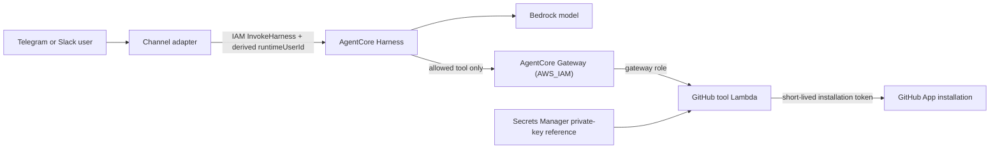

# Design and principles

## Decision

Keep AgentCore Harness as the managed agent loop. Put channel handling at a
trusted edge. Give the agent a GitHub App installation identity through an
AgentCore Gateway Lambda target.

The first complete product slice is:

```text
Telegram long polling or Slack Socket Mode
  -> trusted channel adapter
  -> IAM/SigV4 InvokeHarness
  -> AgentCore Harness
  -> IAM-authorized AgentCore Gateway
  -> Lambda GitHub tool broker
  -> selected-repository GitHub App installation
```

This is an agent-owned GitHub identity. It is not user-delegated access.
User-delegated GitHub remains a later option, gated on a working Harness 3LO
implementation or an explicit decision to replace Harness with custom Runtime.

## Why this design

The native Harness `agentcore_gateway` authorization-code flow was tested on
2026-07-24. The Harness MCP client called `GetResourceOauth2Token` without
`ResourceOauth2ReturnUrl`, despite the same return URL being configured on the
Harness tool and generated workload identity. It never produced a usable
consent flow.

That failure is specific to user-delegated outbound OAuth. It does not invalidate
Harness, Gateway, IAM invocation, or machine-owned tools.

A GitHub App installation is the smallest secure path to useful repository
access:

- installation tokens represent the app, not a human;
- installation is limited to selected repositories;
- permissions are explicit and narrower than OAuth App `repo`;
- short-lived installation tokens are created inside the tool broker and never
  enter prompts, Harness events, or channel messages;
- no Cognito account, browser link, refresh-token store, or per-user Token Vault
  binding is required.

## Architecture


```mermaid
flowchart LR
  U["Telegram or Slack user"] --> A["Channel adapter"]
  A -->|"IAM InvokeHarness + derived runtimeUserId"| H["AgentCore Harness"]
  H --> M["Bedrock model"]
  H -->|"allowed tool only"| G["AgentCore Gateway (AWS_IAM)"]
  G -->|"gateway role"| L["GitHub tool Lambda"]
  L -->|"short-lived installation token"| GH["GitHub App installation"]
  S["Secrets Manager private-key reference"] --> L
```

### Trust boundaries

| Boundary | Authentication | Authorization |
|---|---|---|
| Telegram to adapter | Telegram Bot API over the bot-authenticated `getUpdates` channel | private chats and configured Telegram user allow-list |
| Slack to adapter | pre-authenticated Socket Mode WebSocket | configured workspace plus user/channel allow-list; direct messages first |
| Adapter to Harness | one narrowly scoped AWS IAM role using SigV4 | `InvokeHarness` on one Harness; `InvokeHarnessForUser` only if required by the final SDK/API shape |
| Harness to Gateway | Harness execution role | `InvokeGateway` on one Gateway and exact `allowedTools` |
| Gateway to Lambda | Gateway service role | `lambda:InvokeFunction` on one qualified function ARN |
| Lambda to GitHub | GitHub App JWT exchanged for an installation token | selected installation, repository allow-list, and read-only App permissions |

The adapter derives `runtimeUserId`; users never supply it. It is a session and
memory partition key, not proof that GitHub acted as that user. Use a
pseudonymous stable value:

```text
sha256(channel + ":" + workspace_or_bot + ":" + platform_user_id)
```

Do not mix Telegram and Slack history unless a separate, explicit account-linking
feature is designed.

## Components

### Agent contract

`agents/<name>/agent.yaml` owns portable intent: model, prompt, limits, tags,
and normalized capability names. It does not contain provider ARNs, account
IDs, installation IDs, channel tokens, private keys, callback URLs, or IAM.

The compiler boundary must emit a normalized object before Terraform modules
consume it. Raw YAML field naming must not leak into modules.

### Channel core

Create a shared channel-neutral application service. Adapters translate native
events into:

```text
ChannelMessage {
  channel
  tenant_id
  user_id
  conversation_id
  message_id
  text
}
```

The shared service owns:

- allow-list enforcement;
- stable user/session derivation;
- `/new`, help, and retry behavior;
- duplicate-event suppression;
- Harness invocation and safe stream rendering;
- output chunking and redacted diagnostics.

Adapters own only transport parsing, acknowledgement, and response delivery.

Telegram remains private-chat long polling for development. Slack starts with
Socket Mode because it needs no public request URL. Direct messages are the
first Slack surface; mentions or shared channels are additive after privacy and
threading tests.

### Harness

Harness remains the only agent loop. Deploy one IAM/SigV4 Harness without native
authorization-code OAuth. Attach one Gateway tool and allow only the reviewed
GitHub operations.

Built-in shell, filesystem, browser, and code interpreter stay disabled unless
separately added to the public agent contract and threat model.

The execution role gets only model invocation, required Harness-managed
session/memory access, observability, and `InvokeGateway` on the selected
Gateway. Remove Token Vault, OAuth client-secret, and
`GetResourceOauth2Token` permissions from the machine-identity deployment.

### GitHub Gateway and tool broker

Use one `AWS_IAM` MCP Gateway with one Lambda target. The Gateway role can invoke
only that Lambda. The Lambda owns GitHub authentication and policy enforcement.

Initial tools:

| Tool | Inputs | Enforced boundary |
|---|---|---|
| `getRepository` | owner, repo | installed and configured repository only |
| `getFile` | owner, repo, path, optional ref | read-only contents; size and binary limits |

Add pull-request or issue reads only after the first two tools pass live
validation. No arbitrary URL, GraphQL document, HTTP method, header, shell
command, repository wildcard, or mutation input.

The Lambda:

1. validates the Gateway tool name and JSON input;
2. checks owner/repo against an environment-owned allow-list;
3. reads the GitHub App private key from a referenced secret;
4. creates a short-lived App JWT;
5. requests an installation token narrowed to the required repository and
   permissions;
6. calls a fixed GitHub REST endpoint with an explicit API version and
   `User-Agent`;
7. returns a bounded, normalized response;
8. logs only request IDs, tool name, installation/repository IDs, status,
   duration, and error class.

Never log or return App JWTs, installation tokens, private-key material,
authorization headers, or raw provider errors. Return only the requested bounded
repository content to Harness; never copy that content into diagnostics.

### GitHub App

MVP permissions:

- Repository metadata: read-only/implicit.
- Contents: read-only.
- Selected repositories only.
- No webhooks unless a later feature needs them.
- No organization permissions.
- No write permissions.

The App ID and installation ID are non-secret configuration. The private key is
a secret. Terraform consumes only its secret ARN; secret material must not
enter Terraform state.

## User-delegated GitHub

GitHub App user access tokens are the preferred eventual user identity because
their effective access is the intersection of App permissions, installation
scope, and user permissions.

Do not implement user delegation by passing a model-supplied user ID to the
Lambda target. AgentCore Lambda target context does not document an authenticated
end-user identity field, so that would permit confused-deputy behavior.

User delegation may proceed only when one of these is true:

1. Harness fixes and live validation proves its 3LO call includes the return
   URL and preserves two-user token isolation; or
2. the project explicitly accepts a custom Runtime or trusted orchestration
   service that performs OAuth and tool calls with authenticated user context.

Required proof: authorize A only; B receives no A data; authorize B; both users
receive only their own GitHub results; token reuse and revocation are tested.

## State and lifecycle

Target state owners:

```text
platform/github-app-tool  -> Gateway, Lambda target, Lambda, roles, logs
agents/github-assistant   -> Harness, execution role, model/tool configuration
```

GitHub App registration, installation, repository selection, and private-key
creation are operator actions. Terraform receives non-secret IDs and a
pre-existing secret ARN.

The source for the deployed Cognito identity stack, JWT Gateway/Harness, and
OAuth provider was removed. Do not recreate it. Retirement still requires
separate reviewed destroy plans and explicit authorization; retained S3 state
history is not a runtime dependency.

## Safety

- Read-only GitHub first.
- Repository allow-list enforced in Lambda, not only in the prompt.
- Exact Harness `allowedTools`.
- Bounded inputs and outputs.
- Deny raw URLs, arbitrary refs where policy requires a fixed branch, and path
  traversal-like values.
- Channel allow-lists before Harness invocation.
- Per-channel rate limits and concurrency limits.
- No platform credentials in YAML, state, plans, logs, events, prompts, or
  replies. Treat retrieved private repository content as sensitive user data.
- Every future mutation needs a separate tool, explicit user confirmation,
  branch/PR-only initial scope, idempotency, and audit evidence.

## Verification model

Claims remain layered:

1. source formatting and unit tests;
2. provider-backed Terraform/Terragrunt validation;
3. reviewed plans;
4. applied resources and readiness;
5. successful Harness chat from each channel;
6. successful GitHub tool call through the full path;
7. security-negative tests.

Never collapse these into “working.”

## Validation basis

Reviewed 2026-07-24 against:

- AWS Harness tools: <https://docs.aws.amazon.com/bedrock-agentcore/latest/devguide/harness-tools.html>
- AWS Gateway Lambda targets: <https://docs.aws.amazon.com/bedrock-agentcore/latest/devguide/gateway-add-target-lambda.html>
- AWS Gateway target authorization: <https://docs.aws.amazon.com/bedrock-agentcore/latest/devguide/gateway-building-adding-targets-authorization.html>
- AWS inbound/outbound identity: <https://docs.aws.amazon.com/bedrock-agentcore/latest/devguide/runtime-oauth.html>
- GitHub App authentication: <https://docs.github.com/en/apps/creating-github-apps/authenticating-with-a-github-app/about-authentication-with-a-github-app>
- GitHub App permission selection: <https://docs.github.com/en/apps/creating-github-apps/registering-a-github-app/choosing-permissions-for-a-github-app>
- Slack Socket Mode: <https://docs.slack.dev/apis/events-api/using-socket-mode/>
- Telegram Bot API: <https://core.telegram.org/bots/api>

Provider 6.55.0 source validation already demonstrated Harness and Gateway
resources. The Lambda-target schema still requires a local provider-backed
validation task before implementation is called ready.

## Principles

1. Harness is the product constraint; custom Runtime is an explicit exception.
2. Machine identity before user delegation.
3. Channel identity partitions sessions; it does not silently become GitHub
   identity.
4. Policy is enforced at the narrowest executable boundary.
5. Ownership and state follow independent lifecycles.
6. YAML owns portable intent; environment composition owns bindings.
7. Secrets cross by reference only.
8. New capabilities are deny-by-default and evidence-driven.
9. Mutation is a different product, not an extra scope.
10. Documentation states the highest verified layer only.
